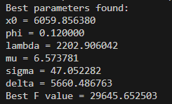

# Report

This code intends to find the optimal value of some function $F: \mathcal{P} \longrightarrow \mathbb{R}^+$, using a Monte Carlo strategy. We evaluate the function on certain random points and take the best aproximation.

- Why the quality of random numbers is enough to guarantee a good quality solution?
    
    In the implementation of this program we generate a pseudo-random integer using xorshift64, then we normalize it to fit some range and step. The quality of random numbers is enough to guarantee a good quality solution because it ensures that the explored cells in which we evaluate the funciton are uniformly distributed across the search space. 

- What decisions have been taken while writing the program?

    Some decisions taken in this program include evaluating the differential equation using a simple iterative strategy rather than using more advanced numerical methods. Using those lead to a waste ot computing time since, at the end of the day, we are just trying to find a minimum by evaluating random points.

- Which is the adopted discretization strategy and what are its benefits?
    
    We used the discretization strategy proposed in the assignment: 

    The benefit of this strategy is that we only need to generate a random integer and then fit it into the range and step. This strategy is better since generating a random integer is easier than generating a random float.

Considering the discretization we chose, there will be around $2^{19 + 32 + 19 +24 + 19 + 16} = 2^{129} \approx 6.81 \cdot 10^{38}$ cells. The amount of tries for the program to be likely to find a good enough aproximation is huge. Even with 10 milion tries as implemented it is unlikely that we find a good result. 

